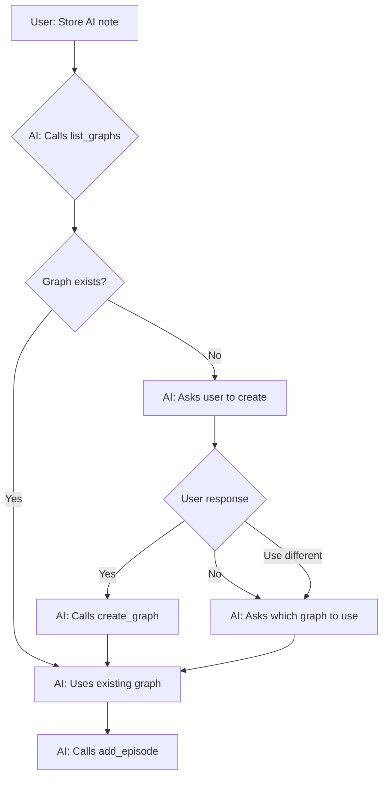

# Dynamic Graph Discovery Implementation Package

## Overview

This package contains everything Claude Code needs to implement dynamic graph discovery with strict mode for the Graphiti MCP server.

## What's Included

### 📋 Documentation Files

1. **CLAUDE.md**
   - Project context for Claude Code
   - Architecture decisions and rationale
   - Design patterns and principles
   - Common pitfalls to avoid
   - **Use:** Place in project root for Claude Code context

2. **IMPLEMENTATION_GUIDE.md**
   - Step-by-step implementation instructions
   - Detailed explanation of each change
   - Implementation order and timing
   - Post-implementation checklist
   - **Use:** Reference guide for the implementation process

3. **TESTING_GUIDE.md**
   - Comprehensive test scenarios
   - Unit, integration, and performance tests
   - Expected inputs and outputs
   - Test automation scripts
   - **Use:** Validate implementation completeness

4. **QUICKSTART.md**
   - Getting started with Claude Code
   - Command reference
   - Troubleshooting tips
   - Time estimates
   - **Use:** Your guide for using Claude Code

5. **code_changes.py**
   - Exact code to implement
   - Complete function implementations
   - Pattern templates
   - Working examples
   - **Use:** Reference implementation

## Key Features Being Implemented

### ✨ Dynamic Discovery
- Query FalkorDB directly for existing graphs
- No manual registry to maintain
- Real-time graph list via `GRAPH.LIST` command

### 🔒 Strict Mode
- Graphs must exist before use
- Prevents accidental graph proliferation
- Natural user control through error messages

### 🎯 Domain Isolation
- Separate graphs for different contexts
- Native FalkorDB multi-tenancy
- No instance pooling needed

### 🤖 AI-Friendly
- Clear tool descriptions guide behavior
- Helpful error messages create checkpoints
- Metadata helps AI choose correct graph

## The Solution in a Nutshell

### ❌ Original Approach (Overly Complex)
```python
# Instance pooling - NOT NEEDED
GRAPHITI_INSTANCES = {}  
graphiti = get_graphiti_for_group(group_id)
```

### ✅ New Approach (Simple & Native)
```python
# Just pass graph_name - FalkorDB handles isolation
graphiti = Graphiti(
    uri="falkor://localhost:6379",
    graph_name=actual_graph_name  # That's it!
)
```

## Three New Tools

### 1. list_graphs()
```python
# Discover existing graphs
response = await list_graphs()
# Returns: {"graphs": [...], "guidelines": {...}}
```

### 2. create_graph(graph_id, description)
```python
# Create new graph (strict mode - only way)
response = await create_graph("ai-research", "AI/ML notes")
# Returns: {"status": "success", "graph_id": "ai-research", ...}
```

### 3. Modified Tools (add_episode, search, etc.)
```python
# Add optional group_id parameter
response = await add_episode(
    name="Note",
    episode_body="Content",
    group_id="ai-research"  # NEW: Optional domain
)
```

## Architecture Diagram

```
User Request
    ↓
MCP Tool (add_episode, search, etc.)
    ↓
Determine graph_name (group_id or default)
    ↓
Validate graph exists (strict mode)
    ↓
Create Graphiti(graph_name=X)  ← KEY: Pass graph_name
    ↓
FalkorDB handles isolation natively
    ↓
Separate graph data automatically
```

## User Experience Flow



## Quick Start

### For Developers (Using Claude Code)

1. **Install Claude Code:**
   ```bash
   npm install -g @anthropic-ai/claude-code
   ```

2. **Navigate to your Graphiti fork:**
   ```bash
   cd /path/to/graphiti
   git checkout -b feature/dynamic-graph-discovery
   ```

3. **Copy files:**
   ```bash
   cp CLAUDE.md ./
   cp *.md ./docs/
   ```

4. **Launch Claude Code:**
   ```bash
   claude
   ```

5. **Give Claude the task:**
   ```
   Please implement the dynamic graph discovery feature.
   Start by reading CLAUDE.md and IMPLEMENTATION_GUIDE.md.
   ```

6. **Test:**
   Follow TESTING_GUIDE.md

See **QUICKSTART.md** for detailed instructions.

### For Manual Implementation

If you prefer to implement manually:

1. Read IMPLEMENTATION_GUIDE.md
2. Follow code examples in code_changes.py
3. Test using TESTING_GUIDE.md
4. Reference CLAUDE.md for design decisions

## File Organization Recommendation

```
your-graphiti-fork/
├── CLAUDE.md                          # ← Context for Claude Code
├── mcp_server/
│   └── graphiti_mcp_server.py        # ← Changes go here
├── docs/
│   ├── IMPLEMENTATION_GUIDE.md       # ← Implementation steps
│   ├── code_changes.py               # ← Reference code
│   ├── TESTING_GUIDE.md              # ← Test scenarios
│   └── QUICKSTART.md                 # ← Getting started
└── tests/
    └── test_graph_discovery.py       # ← Create after impl
```

## Benefits Summary

| Aspect | Before | After |
|--------|--------|-------|
| **Graph Discovery** | Manual config | Dynamic query |
| **Graph Creation** | Run new server | Call create_graph() |
| **Isolation** | Multiple servers | Single server, multiple graphs |
| **Maintenance** | Manual registry | Zero maintenance |
| **Scalability** | Server per domain | 10K+ graphs per server |
| **User Control** | Config files | Natural conversation |
| **Complexity** | Instance pooling | Native FalkorDB |

## Technical Highlights

### FalkorDB Commands Used
```python
# List all graphs
graphs = db.connection.execute_command('GRAPH.LIST')

# Get graph info  
info = db.connection.execute_command('GRAPH.INFO', 'ai-research')

# Store metadata
db.connection.set('graph_metadata:ai-research', json_data)
```

### Graphiti Integration
```python
# The magic happens here
graphiti = Graphiti(
    uri=f"falkor://{host}:{port}",
    graph_name="ai-research",  # Different name = isolated graph
    # ... config
)
```

### Validation Pattern
```python
# Strict mode validation
existing = db.connection.execute_command('GRAPH.LIST')
if group_id not in existing:
    return error_with_helpful_message()
```

## Testing Checklist

- [ ] Empty state works
- [ ] Graph creation works
- [ ] Invalid names rejected
- [ ] Duplicate creation blocked
- [ ] Non-existent graph errors
- [ ] Episode storage works
- [ ] Graph isolation verified
- [ ] Search works per graph
- [ ] Metadata displayed correctly
- [ ] AI workflow tested

See TESTING_GUIDE.md for complete test suite.

## Time Estimates

- **Reading context:** 5-10 min
- **Implementation:** 30-45 min (with Claude Code)
- **Testing:** 20-30 min
- **Total:** 1-1.5 hours

## Dependencies

```txt
falkordb>=4.0.0
graphiti-core>=0.3.0
mcp>=0.1.0
```

## Troubleshooting

### Claude Code Issues
- **Won't start:** Check npm installation
- **Can't see files:** Run from project root
- **Confused:** Ask it to re-read CLAUDE.md

### Implementation Issues
- **Tests fail:** Compare to code_changes.py
- **Graphs not isolated:** Check graph_name parameter
- **Validation not working:** Verify GRAPH.LIST call

## Research Background

This design is based on:
- Context contamination in AI memory systems
- Proactive interference across domains  
- Benefits of domain separation for retrieval

## Success Criteria

✅ Dynamic discovery working (list_graphs())  
✅ Explicit creation working (create_graph())  
✅ Strict mode preventing auto-creation  
✅ All tools support group_id parameter  
✅ Graphs properly isolated  
✅ Helpful error messages  
✅ All tests passing  
✅ Clean git history  

## Next Steps

After implementation:
1. Create PR to your main branch
2. Update README with examples
3. Consider additional tools (delete_graph, suggest_graph)
4. Monitor usage patterns
5. Iterate based on feedback

## Support

Questions about:
- **Architecture:** Read CLAUDE.md
- **Implementation:** Read IMPLEMENTATION_GUIDE.md  
- **Code:** Read code_changes.py
- **Testing:** Read TESTING_GUIDE.md
- **Getting Started:** Read QUICKSTART.md

## License

Same as Graphiti (Apache 2.0)

---

**Ready to implement?** Start with QUICKSTART.md! 🚀
